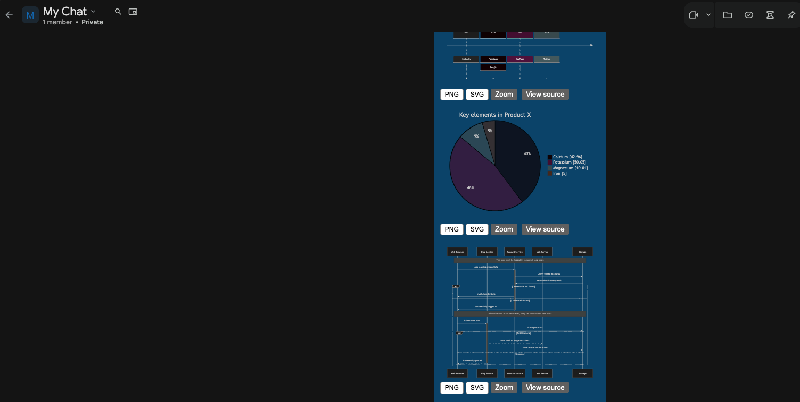
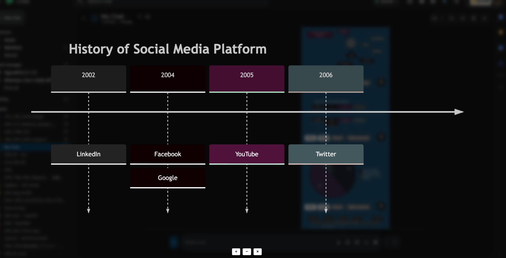

# Mermaid Preview for Google Chat

Chrome extension (Manifest V3) that renders Mermaid code blocks inline in Google Chat web —
on both `chat.google.com` and Google Chat embedded in Gmail (`mail.google.com`).

## Install

**For users — from a release (no build needed):**

1. Go to the [latest release](https://github.com/hblab-tuannv/Mermaid-Preview-for-Google-Chat/releases/latest)
   and download `mermaid-preview-google-chat-v<version>.zip`.
2. Unzip it to a folder you will keep (Chrome loads the extension from this folder).
3. Open `chrome://extensions`, enable **Developer mode** (top-right).
4. Click **Load unpacked** → select the unzipped folder.
5. Open https://chat.google.com or https://mail.google.com (Chat panel) and open a space with a
   ` ```mermaid ` code block — the diagram renders inline.

> Also available on the Chrome Web Store (public listing) — the release zip is for users who
> prefer manual install or want a specific version.

## Screenshots

Inline rendering of a Mermaid code block in a Google Chat message:



Click a diagram to open it in a full-screen zoom view:



## Develop

```bash
npm install        # install toolchain
npm test           # run Vitest with coverage
npm run build      # build dist/ (content.js, background.js, manifest.json)
```

## Load the extension (from source)

1. `npm run build`
2. Open `chrome://extensions`, enable **Developer mode**.
3. **Load unpacked** → select the `dist/` folder.
4. Open https://chat.google.com or https://mail.google.com — the content script logs
   `[mermaid-preview] content script loaded`.

## Architecture

See `docs/features/MAIN/US-001/design.md` (ADR-MAIN-001): Vite multi-entry IIFE build,
TypeScript strict, hand-authored `public/manifest.json`. Rendering logic lives in
`src/lib/` (framework-agnostic, unit-tested); DOM injection in `src/content/`.
